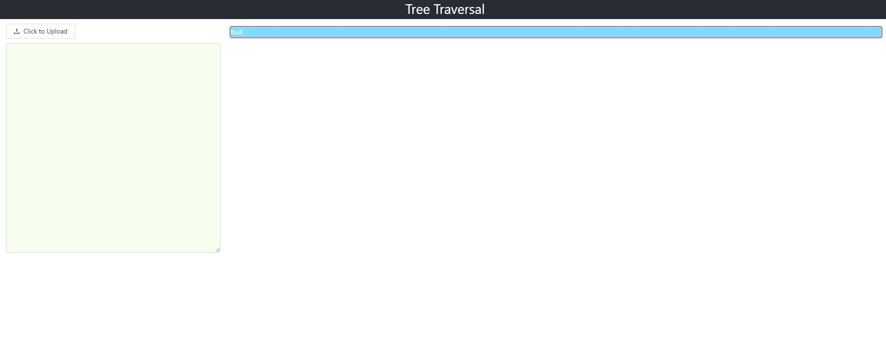
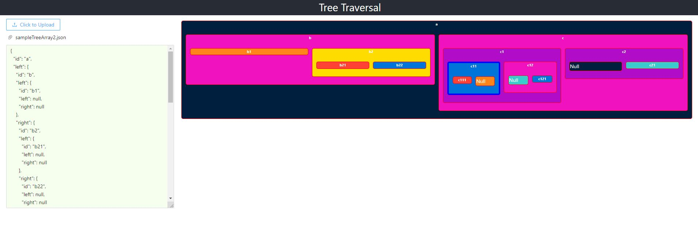

# 
## Author
**Rodolfo Lugo**  [linkedin]

## Preview



## Features
- Changed the class structure to use react hooks (useState, useEffect)
- Implemented redux store/redux slice to manage the application state. (I dont have previous experience with mobx)
- Created a recursive function **parseArrayToTree** on the file *"TreeTextArea/index.tsx"*
-Implemented a DeepLevel variable, to know how deep is the current node. Because we are using recursive function, a easy solution is implement the currentDeepLevel + 1 to track the deepLevel 
- The deeper node has a dashed border of 5 px in blue color
- Created a recursive function **convertObjToClass** on the file *"FileSelector/index.tsx"*
- Improved the css/design using ant design library
- Implemented error alert message on the parsing process
- Each tree has a own color randomly selected on each render. Litte code to avoid the select the same color than the father for a better visualization on the file *"TreeOutput/index.tsx"*

## TODO
- Implement unittest using jest. To ensure the correct behaviour of the **parsearrayToTree** and **convertObjetToClass** 
- Implement E2E test using https://www.cypress.io/ . to ensure the correct visualization of the treeOuput.
- Allow the user to edit/add/delete tree nodes on the visual interface. 
    - Adding an new attribute into the **BinTreeNode** class. This attribute will be "label", so, we'll use the id from the string as a label. An will autogenerate an unique id for each node        
    - On the  **convertObjetToClass** method I'll incluse a hashTable/hashMap to has an quick access into each node. We will se the unique id as a key, and the full node as value.
    - Now on the TreeOutput file I can access directly into the each node using the  node id and we can edit/remove/add new nodes directly from the treeOutput component. (All this using redux store to comunicate the component) 


## Main Requirements
These are the core dependencies. With yarn you will install the rest of dependencies
- [yarn] - Yarn is a package manager that doubles down as project manager.
- [node.js] - evented I/O for the backend

## Install with yarn
```sh
cd microsoft_test
yarn
yarn start
```

## Install with npm
```sh
cd microsoft_test
npm install
npm run start
```
   [node.js]: <http://nodejs.org>
   [yarn]: <https://yarnpkg.com/>
   [linkedin]: <https://www.linkedin.com/in/rodolfo-lugo/>
   